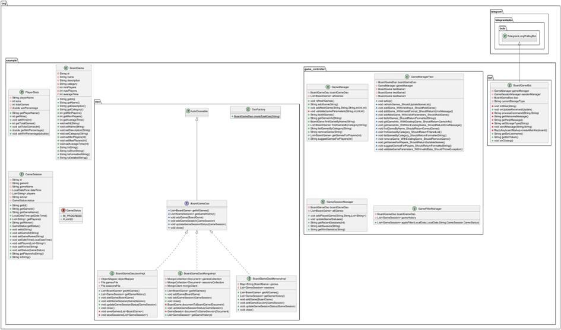
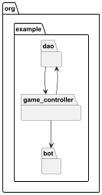

# CollectionBoardGames_bot

Программа предназначена для помощь в выборе настольных игр. Реализована с использованием Telegram Bot.

## Основные функции программы:
* Получение списка игр
* Добавление новой настольной игры с указанием названия, описания, категории игры, минимальное количество игроков максимальное количество игроков, среднее время игр
* Получение списка последних 5 игровых сессий
* Добавление новой сессии с указанием победителя. всех игроков, названием игры
* Получение статистики побед по игре
* Смена источников хранения денных
* Автоматическое обновление статусов сессий после истечение времени

## Диаграмма классов по пакетам

## Диаграмма пакетов проектируемой системы

### Интерфейс и реализации доступа к данным:
* **BoardGameDao** - интерфейс DAO, задающий единый контракт взаимодействия с хранилищами;
* **BoardGameDaoMemoryImpl**, BoardGameDaoMongoImpl и BoardGameDaoJsonImpl – реализации DAO для разных типов хранилищ;
* **DaoFactory** – переключение между типами хранильщ.

### Компоненты бизнес-логики:
* **GameFilterManager** – Фильтрация и поиск игр
* **GameManager** - работы с игровой коллекцией.
* **GameSessionManager** – Запись результатов партий, подсчёт статистики по игрокам

### Служебные классы:
* **BoardGameBot** – связующее звено между интерфейсом и бизнес-логикой; реализует обработку событий от пользователя, вызовы к DAO и сервисам;
* **Main** – Запуск бота.
